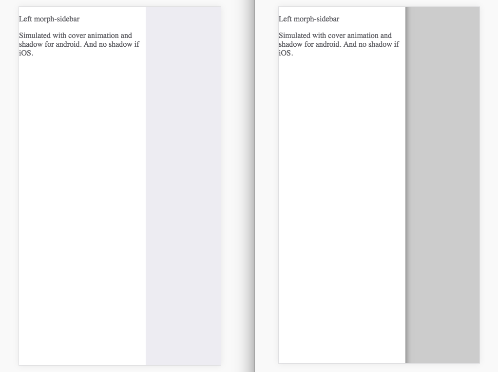

# \<morph-sidebar\>

  Sidebar that morphs for current mobile OS

## Getting Started:
For the information about how to clone the desired repository, running the local server and testing, please refer to this [link](https://github.com/moduware/polymorph-components/blob/master/INFO.md).


## Usage Summary

- Here is a quick demo of `<morph-sidebar>`

<p align="center">This is an <kbd>iOS device</kbd> demo on the left... <kbd>vs</kbd> an <kbd>Android device</kbd> demo on the right</p>

<p align="center">
  <kbd></kbd>


  ### How to use our **<morph-sidebar>** component

  - Our **`<morph-sidebar>`** has properties that we can use to setup and use our sidebar

    1. **`align`** - use to choose where to display sidebar, `left` or `right`. It is set to `left` by default when `align` is not added to HTML markup. This is inherited from **`<app-drawer>`** element of 'app-layout'

    2. **`opened`** - takes a Boolean value and use to indicate if the side bar is close or open. also used to toggle our sidebar from close to open and close again using javascript on the page

  **ToDo: eaxmple using very basic usage of `morph-sidebar` panel**

  - We can wrap the whole content with [**app-drawer-layout**][app-drawer-layout] component to make it work with other `<app-layout>` elements like `<app-header>`. We can then use the `drawer-toggle` attribute and place them on any children of the `<app-drawer-layout>` and when click it toggles our sidebar open and close.

    ```html

    <body>

      <app-drawer-layout fullbleed force-narrow>

        <morph-sidebar slot="drawer" align="left" swipe-open>
          <p>Left morph-sidebar</p>
          <p>Simulated with cover animation and shadow for android. And no shadow if iOS.</p>
        </morph-sidebar>

        <app-header-layout>
          <app-header slot="header">
            <app-toolbar>
              <div main-tittle>morph-sidebar</div>
            </app-toolbar>
          </app-header>
        </app-header-layout>

        <div>
          <h4 drawer-toggle>Toggle Left Sidebar</h4>
        </div>

      </app-drawer-layout>


      <script>

        toggleDrawer = function(name) {
          var drawer = document.getElementById(name + 'Sidebar');
          drawer.toggle();
        };

      </script>

    </body>

    ```


  - We may use two (2) `<morph-sidebar>` panels at the same time, one left and one right panel. `align` defaults to `left` when not specified.

    ```html

    <body>

      <morph-sidebar id="leftSidebar" align="left" swipe-open>
        <p>Left morph-sidebar</p>
        <p>Simulated with cover animation and shadow for android. And no shadow if iOS.</p>
      </morph-sidebar>

      <morph-sidebar id="rightSidebar" align="right" swipe-open>
        <p>Right morph-sidebar</p>
        <p>Simulated with cover animation and shadow for android. And no shadow if iOS.</p>
      </morph-sidebar>

      <div>
        <h4 onclick="toggleDrawer('left')">Toggle Left Sidebar</h4>
      </div>

      <div>
        <h4 onclick="toggleDrawer('right')">Toggle Right Sidebar</h4>
      </div>

      <script>

        toggleDrawer = function(name) {
          var drawer = document.getElementById(name + 'Sidebar');
          drawer.toggle();
        };

      </script>

    </body>

    ```

  - We can also use two (2) `<morph-sidebar>` panels with `app-drawer-layout` by doing a nested `app-drawer-layout` setup. We can use only the drawer-toggle attribute on the outer `app-drawer-layout` children. We need to use other ways to open/close the inner `<morph-sidebar>` (which is our right sidebar panel in this example), like using javascript for our example below.

  ```html

   <body>

    <app-drawer-layout fullbleed force-narrow>

      <morph-sidebar slot="drawer" align="left" swipe-open>
        <p>Left morph-sidebar</p>
        <p>Simulated with cover animation and shadow for android. And no shadow if iOS.</p>
      </morph-sidebar>

      <div>
        <h4 drawer-toggle>Toggle Left Sidebar</h4>
      </div>

      <app-drawer-layout force-narrow>

        <morph-sidebar id="rightSidebar" slot="drawer" align="right" swipe-open transition-duration-ios="500">
          <p>Right morph-sidebar</p>
          <p>Simulated with cover animation and shadow for android. And no shadow if iOS.</p>
          <p>This sidebar animation duration is change to 500</p>
        </morph-sidebar>

        <div>
          <h4 onclick="toggleDrawer('right')">Toggle Right Sidebar</h2>
        </div>

      </app-drawer-layout>

    </app-drawer-layout>


    <script>

      toggleDrawer = function(name) {
        var drawer = document.getElementById(name + 'Sidebar');
        drawer.toggle();
      };

    </script>

  </body>

  ```

  **ToDo: Implement the reveal animation using this new `morph-sidebar`**

  - `<morph-sidebar>` has two animation when openning and closing. The default animation of the sidebar is `cover`. It covers the morph-view element when it opens.

  - The other animation is called `reveal` where [**morph-view**][Morph View] moves out and reveals the `<morph-sidebar>` under it. `<morph-view>` moves out of the way to accomodate the width of our sidebar. To use `reveal` we add reveal attribute to `<morph-view>` component.

    ```html

    function closeRightSidebarWithReveal() {
      let view = document.getElementById('mainView');
      view.removeAttribute('reveal');
    }

    document.addEventListener('DOMContentLoaded', function(event) {
      document.getElementById('sidebarRight').addEventListener('open-changed', closeRightSidebarWithReveal);
    });

    ```


[Main Page]: https://github.com/moduware/polymorph-components

[WCT]: https://github.com/Polymer/web-component-tester  

[Polymer Test]: https://www.polymer-project.org/2.0/docs/tools/tests

[Morph View]: https://github.com/moduware/morph-view

[app-drawer-layout]: https://github.com/PolymerElements/app-layout/tree/master/app-drawer-layout
